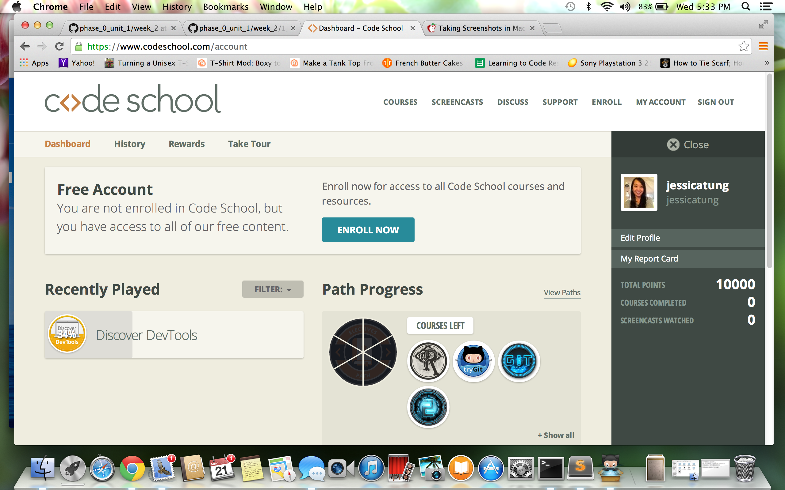

#### Include an inline screenshot of your codeschool's points from the profile page:

<!-- Modify the Markdown to include your answers. Don't delete the questions! -->

##QUIZ
* Explain which tabs support the following actions and how.
  * Realtime editing of HTML and CSS 
      By opening the "elements" tab of the Inspect Element function, you can do realtime editing of HTML and CSS!
  * Javascript Debugging
      By navigating to the appropriate line of CSS in the Sources tab, one can work on javascript debugging. Also, one can navigate to the console tab. To be honest, I'm still a little confused on this section. 
  * Performance Optimization 
      The "Network" tab of the Inspect Element function.

* What's the quick key for your OS to spawn the Dev Tools inspector?
    Keyboard shortcut is: alt/option - cmd - i

* Go to http://www.postmachina.com/ and analyze and tweak this nicely designed page.
  * What is the current background color for the page?  (Surprisingly, it's not just black!)
      #0b0f11
  * Tweak the background color to white.
  * Tweak the height of the side bar that contains the logo.  Shrink it down to 85px.
  * Roll over the navigation links.  When you hover over them, they dissapear.  Let's change the hover color to black instead.
  * Now take a screenshot of your new (and maybe not so improved) design.  It should match this screenshot: http://postimg.org/image/5ak1jkpl5/
  * Upload your own image to the imgs directory in the `1_Chrome_Dev_Tools` directory.  It should match the image above. The last nav link in the image above is black because the mouse was hovering there when the screenshot was taken. Do the same, and don't take a screenshot of your whole desktop, just the browser window. (This is part of the challenge.)
      Done.

* For the postmachina website, why can't you tweak the color of the text "The most important things are not things"?  Please explain.
    You cannot tweak the color of the text because that "main" part of the webpage with that text is a .gif from another page!

* Go to www.ticketswizard.com and analyze the page.  
  * What is the largest image on the website? 
    http://www.ticketswizard.com/Images/Catalog/92624182-c482-4a35-8da2-4fbf2f502e94_Large_Large.png
  * Explain how you would find out this information, and list the URL of offending image here and how big it is.
      First, I open the Inspect Element view, and navigate to network tab, then hit reload. I then "disabled cache while DevTools is open" in the settings. Hit reload again. I then clicked on the "size" tab until it sorted in descending order, and it put the largest image at the top. URL: http://www.ticketswizard.com/Images/Catalog/92624182-c482-4a35-8da2-4fbf2f502e94_Large_Large.png. It is 316 KB in size.

* Test the www.ticketswizard.com website with google's [PageSpeed Insights](http://www.ticketswizard.com/).  (You can also download the chrome plugin).  What is the easiest thing to change to optimize the website?  How many kilobytes of data can be eliminated?
    Hmm, this question I'm not sure of the answer. Well, according to DevTools 5.4, it's a good idea to serve correctly sized images. That way, the browser is not having to scale down images to the correct display size. I went through the PageSpeed items one by one, and it looks like the "Optimize Image" would reduce their totaly size by 885.9KiB.
